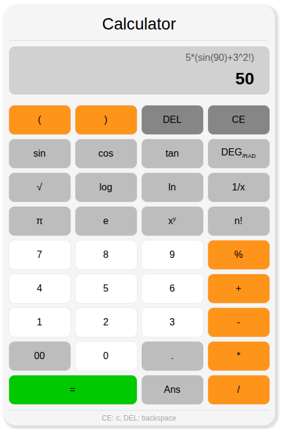

## Scientific Calculator

- A web-based scientific calculator built using HTML, CSS, and JavaScript.
- It supports standard arithmetic operations along with scientific functions like trigonometry, logarithms, factorial, and more.

### Basic Operations
- Addition `+`
- Subtraction `-`
- Multiplication `*`
- Division `/`
- Mod `%`

### Scientific Functions
- sin
- cos
- tan
- log
- ln
- Square root `√`
- Power `^`
- Factorial `!`
- Inverse `1/x`

### Expression Controls
- DEL → delete last character
- CE → clear expression
- Ans → use last answer
- Allow Brackets

### Screenshot

